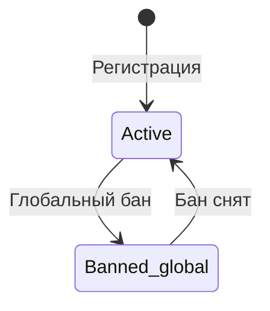
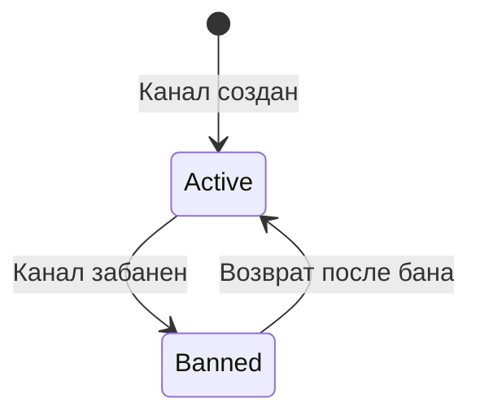
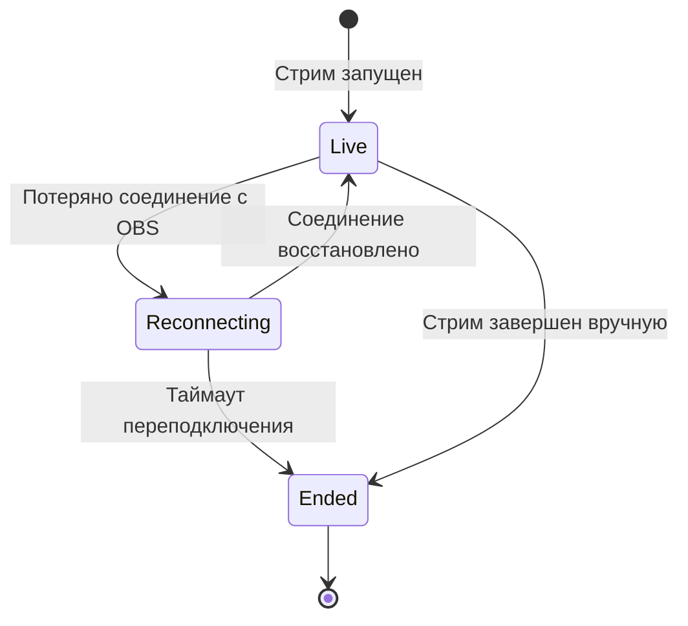
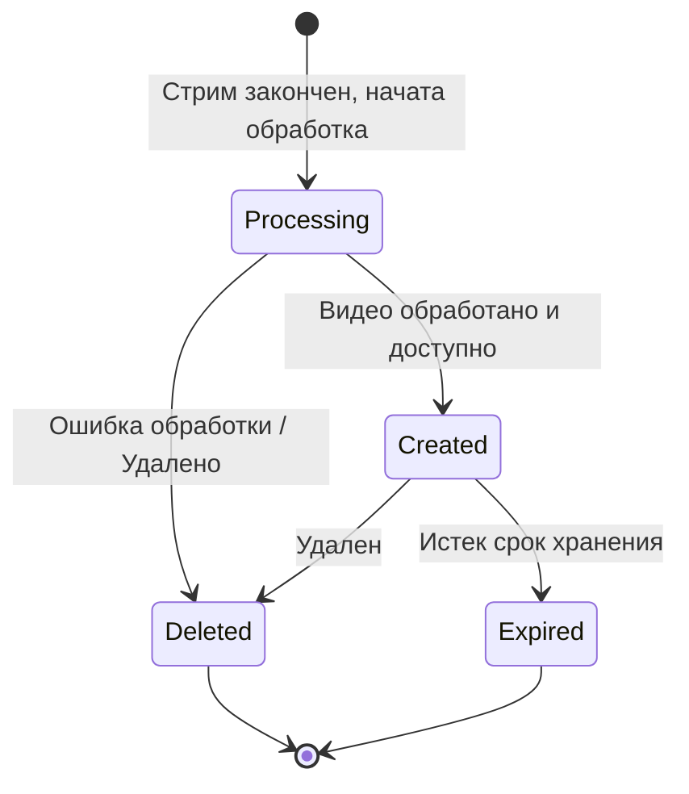
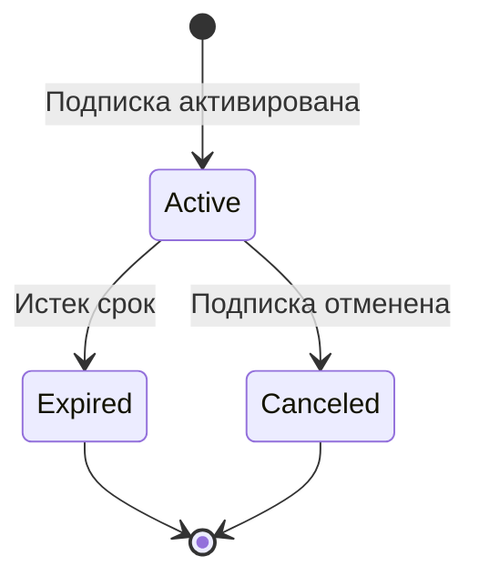
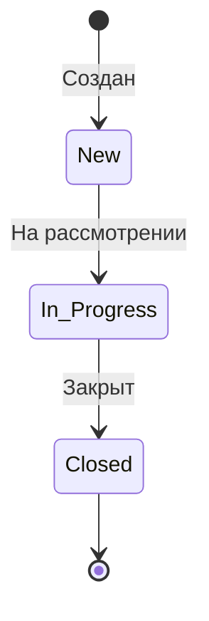

#### Основные сущности системы

| Сущность          | Описание          | Состав данных                                                                                                           |
| ----------------- | ----------------- | ----------------------------------------------------------------------------------------------------------------------- |
| User              | Пользователи      | `user_id`, `username`, `phone`, `password_hash`, `role`, `status`, `created_at`, `verification_code`, `code_expires_at` |
| Channel           | Каналы            | `channel_id`, `user_id`, `channel_name`, `status`, `subscribers_count`, `followers_count`                               |
| Stream            | Стримы            | `stream_id`, `channel_id`, `title`, `stream_key`, `status`, `created_at`, `video_url`                                   |
| VOD               | Записи стримов    | `vod_id`, `stream_id`, `channel_id`, `title`, `created_at`, `expires_at`, `video_url`, `status`                         |
| Message           | Сообщения         | `message_id`, `stream_id`, `user_id`, `content`, `created_at`                                                           |
| Subscription      | Подписки          | `subscription_id`, `user_id`, `channel_id`, `created_at`, `expires_at`, `status`                                        |
| Follower          | Отслеживающие     | `user_id`, `channel_id`, `created_at`                                                                                   |
| Moderation        | Модерация         | `moderation_id`, `moderator_id`, `target_user_id`, `channel_id`, `type`, `created_at`, `expires_at`                     |
| Report            | Репорты           | `report_id`, `reporter_id`, `target_user_id`, `reason`, `created_at`, `status`                                          |
| Channel_Moderator | Модерация каналов | `user_id`, `channel_id`, `created_at`                                                                                   |
| Transaction       | Транзакции        | `transaction_id`, `user_id`, `channel_id`, `amount`, `platform_fee`, `created_at`                                       |

#### Жизненные циклы сущностей и State Machine

#### 1. User

| Статус        | Триггер перехода |
| ------------- | ---------------- |
| Active        | Регистрация      |
| Banned_global | Глобальный бан   |
| Active        | Бан снят         |

---
#### 2. Channel

| Статус | Триггер перехода   |
| ------ | ------------------ |
| Active | Канал создан       |
| Banned | Канал забанен      |
| Active | Возврат после бана |

---
#### 3. Stream

| Статус       | Триггер перехода          |
| ------------ | ------------------------- |
| Live         | Стрим запущен             |
| Reconnecting | Потеряно соединение с OBS |
| Ended        | Стрим закончен            |

---
#### 4. VOD

| Статус     | Триггер перехода    |
| ---------- | ------------------- |
| Processing | В обработке         |
| Created    | Создан              |
| Deleted    | Удален              |
| Expired    | Истек срок хранения |

---
#### 5. Subscription

| Статус   | Триггер перехода      |
| -------- | --------------------- |
| Active   | Подписка активирована |
| Expired  | Истек срок            |
| Canceled | Подписка отменена     |

---
#### 6. Report

| Статус      | Триггер перехода |
| ----------- | ---------------- |
| New         | Создан           |
| In_Progress | На рассмотрении  |
| Closed      | Закрыт           |

