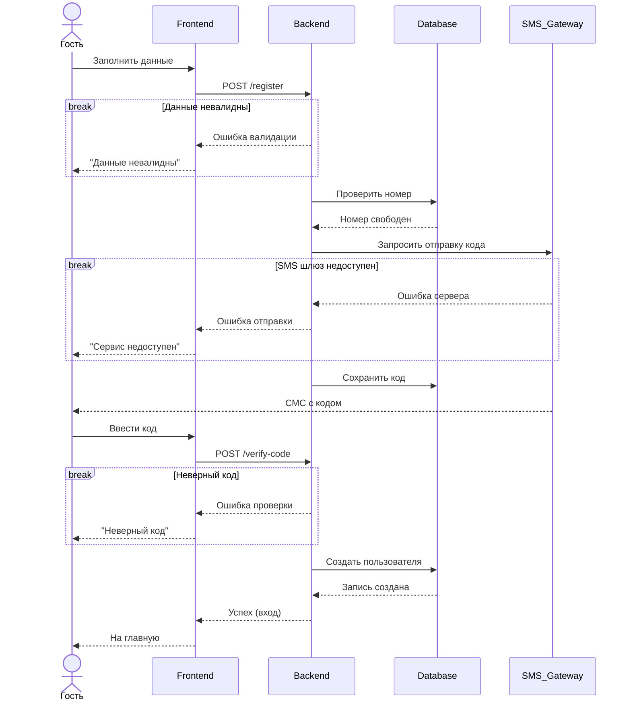
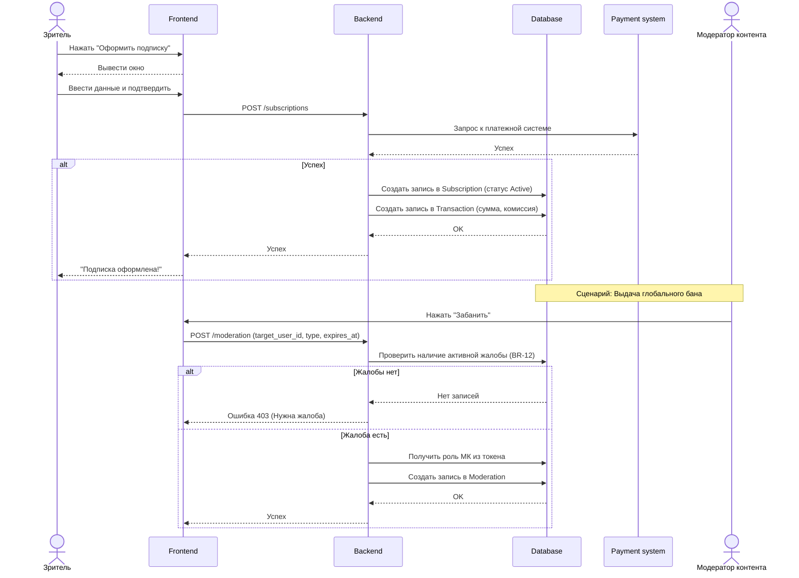
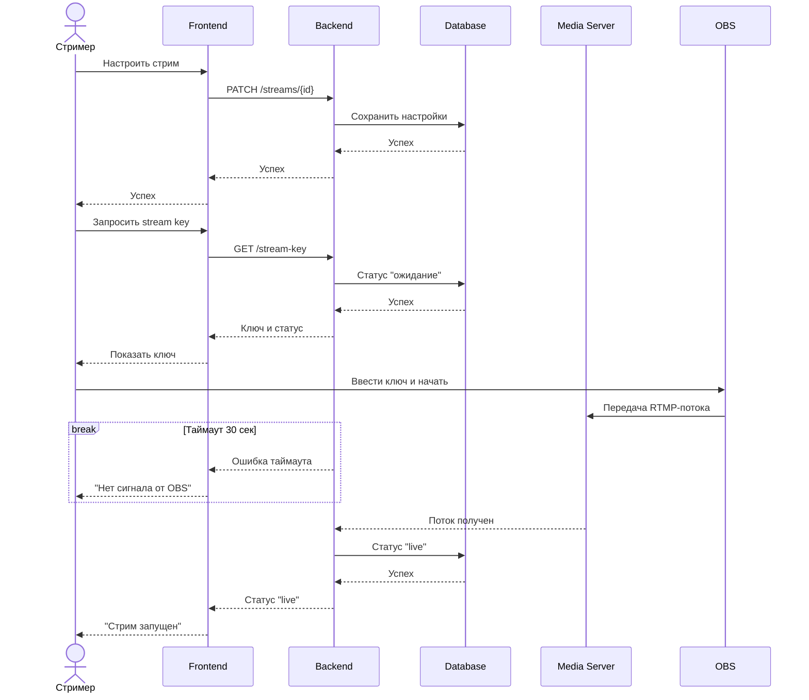
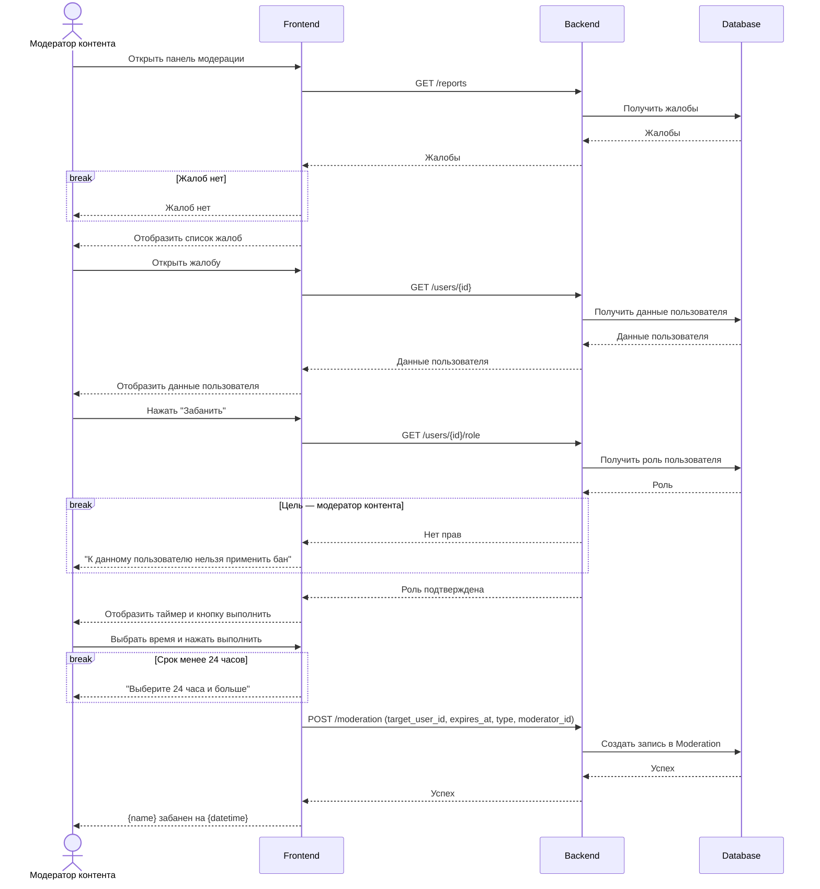

#### 1 Сценарий "Регистрация

``` mermaid
sequenceDiagram
    actor Гость
    participant Frontend
    participant Backend
    participant DB as Database
    participant SMS as SMS_Gateway
    
    Гость ->> Frontend: Заполнить данные
    Frontend ->> Backend: POST /register
    break Данные невалидны
        Backend -->> Frontend: Ошибка валидации
        Frontend -->> Гость: "Данные невалидны"
    end
    
    Backend ->> DB: Проверить номер
    DB -->> Backend: Номер свободен
    Backend ->> SMS: Запросить отправку кода
    break SMS шлюз недоступен
        SMS -->> Backend: Ошибка сервера
        Backend -->> Frontend: Ошибка отправки
        Frontend -->> Гость: "Сервис недоступен"
    end
    
    Backend ->> DB: Сохранить код
    SMS -->> Гость: СМС с кодом
    Гость ->> Frontend: Ввести код
    Frontend ->> Backend: POST /verify-code
    break Неверный код
        Backend -->> Frontend: Ошибка проверки
        Frontend -->> Гость: "Неверный код"
    end
    
    Backend ->> DB: Создать пользователя
    DB -->> Backend: Запись создана
    Backend -->> Frontend: Успех (вход)
    Frontend -->> Гость: На главную
```

#### 5 Сценарий "Оформление подписки"

```mermaid
sequenceDiagram
    actor Зритель
    participant Frontend
    participant Backend
    participant DB as Database
    participant PS as Payment system
    
    Зритель ->> Frontend: Нажать "Оформить подписку"
    Frontend -->> Зритель: Вывести окно
    Зритель ->> Frontend: Ввести данные и подтвердить
    Frontend ->> Backend: POST /subscriptions
    
    Backend ->> PS: Запрос к платежной системе
    PS -->> Backend: Успех
    
    alt Успех
        Backend ->> DB: Создать запись в Subscription (статус Active)
        Backend ->> DB: Создать запись в Transaction (сумма, комиссия)
        DB -->> Backend: OK
        Backend -->> Frontend: Успех
        Frontend -->> Зритель: "Подписка оформлена!"
    end

    Note over МК, DB: Сценарий: Выдача глобального бана
    actor МК as Модератор контента 
    МК ->> Frontend: Нажать "Забанить"
    Frontend ->> Backend: POST /moderation (target_user_id, type, expires_at)
    
    Backend ->> DB: Проверить наличие активной жалобы (BR-12)
    alt Жалобы нет
        DB -->> Backend: Нет записей
        Backend -->> Frontend: Ошибка 403 (Нужна жалоба)
    else Жалоба есть
        Backend ->> DB: Получить роль МК из токена
        Backend ->> DB: Создать запись в Moderation
        DB -->> Backend: OK
        Backend -->> Frontend: Успех
    end
```

#### 6 Сценарий "Настройка и запуск стрима"

```mermaid
sequenceDiagram
    actor Стример
    participant Frontend
    participant Backend
    participant DB as Database
    participant MS as Media Server
    participant OBS

    Стример ->> Frontend: Настроить стрим
    Frontend ->> Backend: PATCH /streams/{id}
    Backend ->> DB: Сохранить настройки
    DB -->> Backend: Успех
    Backend -->> Frontend: Успех
    Frontend -->> Стример: Успех

    Стример ->> Frontend: Запросить stream key
    Frontend ->> Backend: GET /stream-key
    Backend ->> DB: Статус "ожидание"
    DB -->> Backend: Успех
    Backend -->> Frontend: Ключ и статус
    Frontend -->> Стример: Показать ключ
    
    Стример ->> OBS: Ввести ключ и начать
    OBS ->> MS: Передача RTMP-потока
    
    break Таймаут 30 сек
        Backend -->> Frontend: Ошибка таймаута
        Frontend -->> Стример: "Нет сигнала от OBS"
    end

    MS -->> Backend: Поток получен
    Backend ->> DB: Статус "live"
    DB -->> Backend: Успех
    Backend -->> Frontend: Статус "live"
    Frontend -->> Стример: "Стрим запущен"
```

#### 8 Сценарий "Выдача глобального бана пользователю"

```mermaid
sequenceDiagram
    actor МК as Модератор контента 
    participant Frontend
    participant Backend
    participant DB as Database

    МК ->> Frontend: Открыть панель модерации
    Frontend ->> Backend: GET /reports
    Backend ->> DB: Получить жалобы
    DB -->> Backend: Жалобы
    Backend -->> Frontend: Жалобы

    break Жалоб нет
        Frontend -->> МК: Жалоб нет
    end

    Frontend -->> МК: Отобразить список жалоб
    МК ->> Frontend: Открыть жалобу
    Frontend ->> Backend: GET /users/{id}
    Backend ->> DB: Получить данные пользователя
    DB -->> Backend: Данные пользователя
    Backend -->> Frontend: Данные пользователя
    Frontend -->> МК: Отобразить данные пользователя

    МК ->> Frontend: Нажать "Забанить"
    Frontend ->> Backend: GET /users/{id}/role
    Backend ->> DB: Получить роль пользователя
    DB -->> Backend: Роль

    break Цель — модератор контента
        Backend -->> Frontend: Нет прав
        Frontend -->> МК: "К данному пользователю нельзя применить бан"
    end

    Backend -->> Frontend: Роль подтверждена
    Frontend -->> МК: Отобразить таймер и кнопку выполнить
    МК ->> Frontend: Выбрать время и нажать выполнить

    break Срок менее 24 часов
        Frontend -->> МК: "Выберите 24 часа и больше"
    end

    Frontend ->> Backend: POST /moderation (target_user_id, expires_at, type, moderator_id)
    Backend ->> DB: Создать запись в Moderation
    DB -->> Backend: Успех
    Backend -->> Frontend: Успех
    Frontend -->> МК: {name} забанен на {datetime}
```